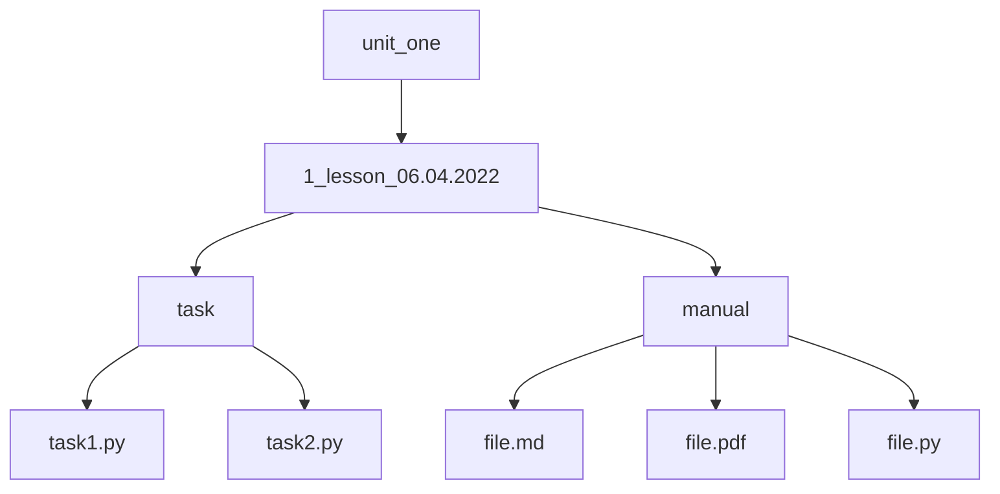
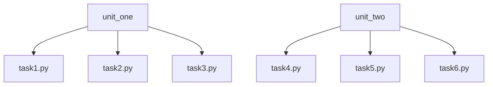

# Репозиторий для выкладки лекций и домашних заданий.

## Описание папок
`unit_one` - папка содержит задачи по первому модулю  
`lesson__1__06.04.2022` - папка на день проведения занятия  
`task` - задачи для выполнения  
`task1.py` - задача нумеруется в диапазоне от 1 до infinity  
`manual` - папка с опорным материалом 

### Пример папки преподавателя:
```
  unit_one
     -- lesson__1__06.04.2022 
             -- task
                  -- task1.py
                  -- task2.py
             -- manual  
                  -- file.md
                  -- file.pdf
                  -- file.py
  unit_two
     -- 10_lesson__10__06.04.2022
     ...
```




### Пример папки слушателя:
`python_spring_2022` - название репозитария слушателя   
`unit_one` - папка содержит задание по модулю. Наименование файлов не
меняется.

```
    unit_one
        -- task1.py
        -- task2.py
        -- task3.py
``` 



